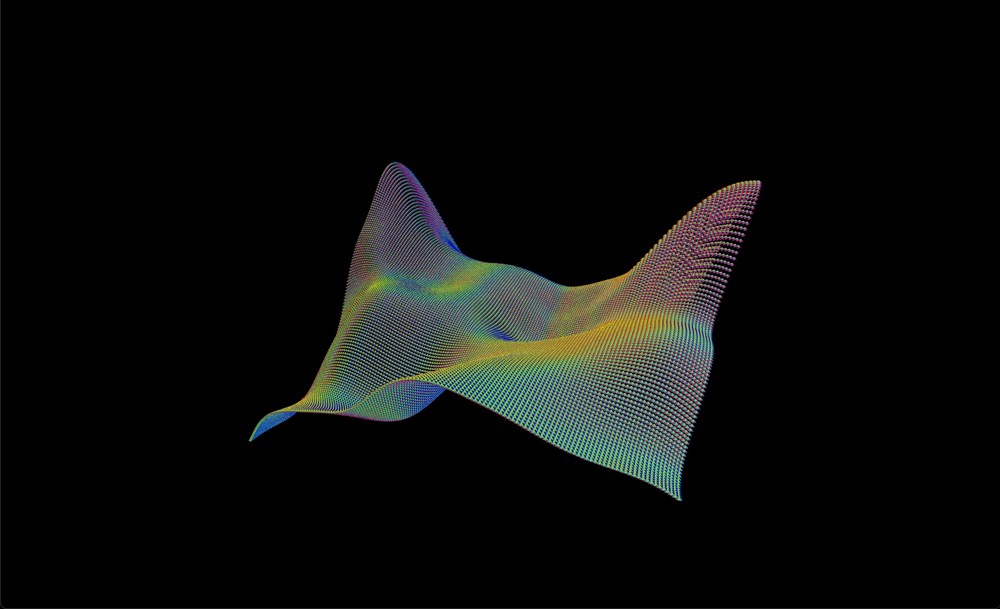

<h3>preview</h3>

<h4>compile with:</h4>
<h5>clang++ -Wall -std=c++17 -I ./dependencies/include -L ./dependencies/library -fcolor-diagnostics -fansi-escape-codes -g  main.cpp glad.c ./dependencies/library/libglfw.3.3.dylib -o ./out -framework OpenGL  -framework Cocoa -framework IOKit -framework CoreVideo -framework CoreFoundation -Wno-deprecated</h5>

<h3>CONTROLS</h3>
<h5>all lower case</h5>
<ul>
  <li>WASD: Movment</li>
  <li>U: Speeds up movement when pressed</li>
  <li>R: Rotates all items</li>
  
  <li>I: Grows items amounts</li>
  <li>L: Shrinks items amount</li>
  
  <li>P: Increases magnitude of hills</li>
  <li>L: Decreases magnitude of hills</li>
  
  <li>M: Increases total hills amount</li>
  <li>N: Decreases total hills amount</li>
  
  <li>O: Decreases item amount by fixed number (dont use, experimental.)</li>
</ul>
